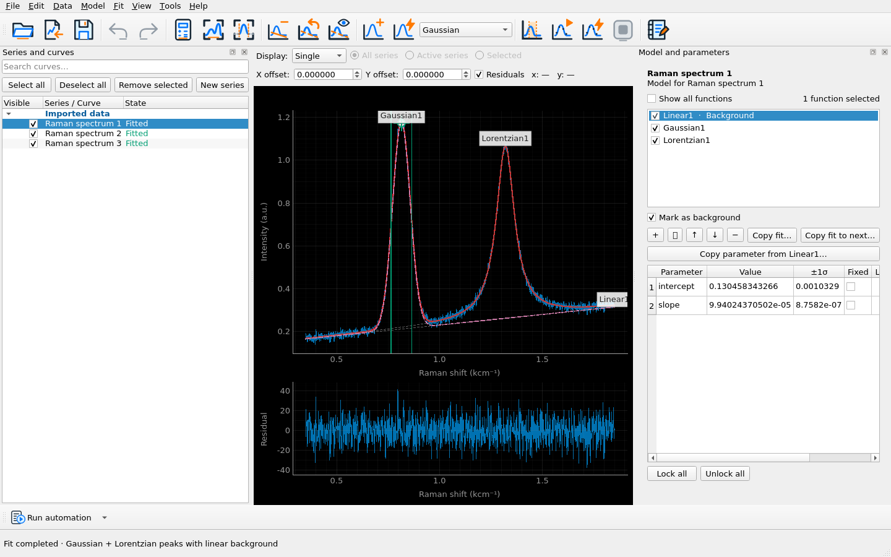
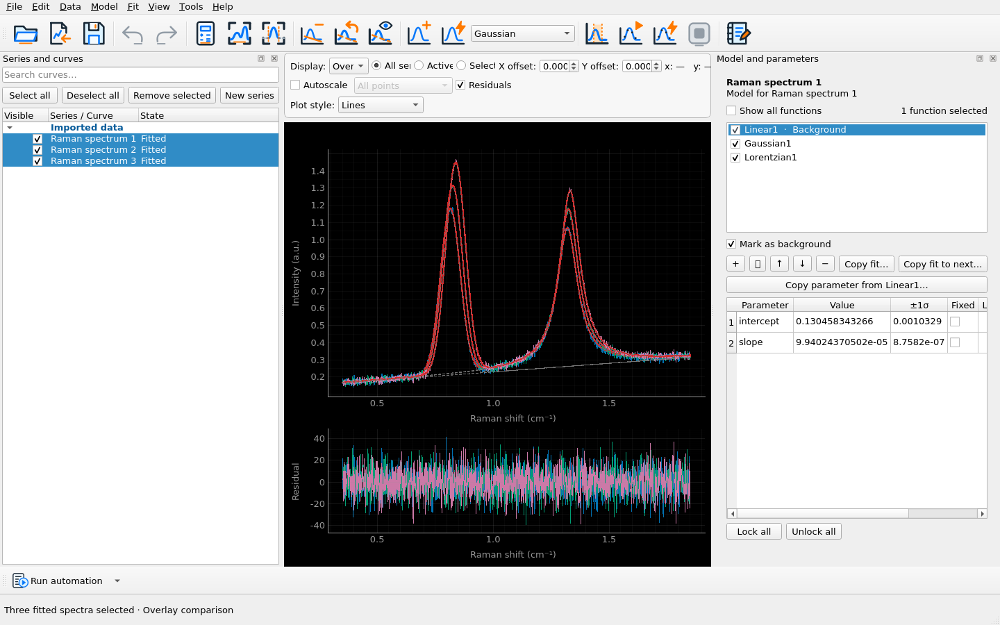
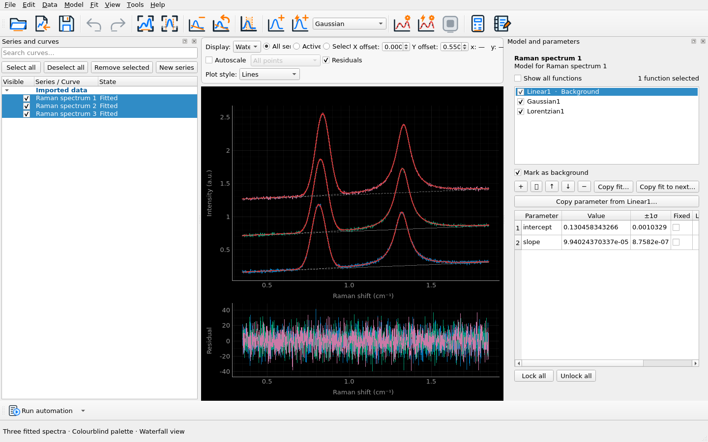
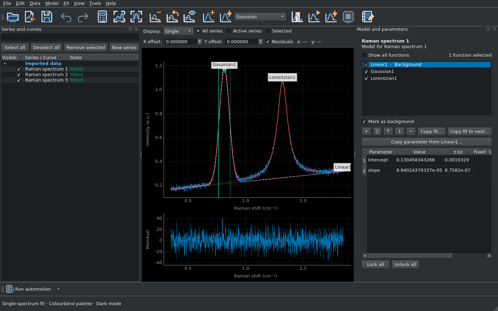

<p align="center">
  
</p>

<h1 align="center">CurveMole</h1>

<p align="center">
  <a href="https://github.com/SebRoLENS/curvemole/releases/latest"></a>
  <a href="https://github.com/SebRoLENS/curvemole/releases/latest"></a>
  <a href="https://github.com/SebRoLENS/curvemole/releases/latest"></a>
  <a href="https://github.com/SebRoLENS/curvemole/releases/latest"></a>
  <a href="https://doi.org/10.5281/zenodo.22276119"></a>
  <a href="https://github.com/SebRoLENS/curvemole/actions/workflows/ci.yml"></a>
</p>

<p align="center"><strong>Scientific curve and peak fitting for spectroscopy, diffraction, kinetics, and general x-y data.</strong></p>

CurveMole is a desktop-first, scriptable scientific data-analysis application for
one-dimensional spectra and curves. It provides interactive curve fitting, peak fitting,
baseline/background modelling, and nonlinear least-squares analysis for IR and Raman
spectra, powder diffraction and XRD patterns, kinetic traces, and general x-y data.
The same scientific engine is shared by the graphical interface, Python API, command
line, and reproducible YAML workflows.

> **Status:** Version **0.12.2 Preview**. The scientific core and desktop workflow
> are usable, but this is not yet the validated 1.0 Stable release.

## Download

**[Download the latest release](https://github.com/SebRoLENS/curvemole/releases/latest)**
· [Browse previous releases](https://github.com/SebRoLENS/curvemole/releases)

Available packages are built automatically for:

- Linux x86_64: AppImage
- Windows x86_64: standalone `.exe`
- macOS Apple Silicon: `.dmg`
- macOS Intel x86_64: `.dmg`
- Python 3.12+: wheel and source distribution

> **Windows and macOS security notice**
>
> Windows SmartScreen or macOS Gatekeeper will probably show a warning on first
> launch because these packages are not currently code-signed or notarized with
> certificates recognised by those platforms. Obtaining and maintaining those
> certificates requires paid developer programmes. CurveMole is free, open-source,
> non-profit software, and the project currently chooses not to fund commercial,
> platform-specific signing programmes or pass those costs on to users. A warning
> caused by a missing signature is not, by itself, evidence that malware was detected.
> Download CurveMole only from the official release page and verify `SHA256SUMS.txt`.

The Linux AppImage is cryptographically signed using the free, open-source Sigstore
infrastructure through GitHub Actions. Every release includes a detached
`.sigstore.json` signature bundle. With the [GitHub CLI](https://cli.github.com/):

```bash
gh attestation verify CurveMole-VERSION-linux-x86_64.AppImage \
  --repo SebRoLENS/curvemole
```

## Why CurveMole?

CurveMole is designed for experimental scientists who want the convenience of an
interactive desktop GUI without giving up reproducibility or scriptability. A fit can
be explored graphically and then reproduced through the Python API, CLI, or YAML
workflow using the same fitting engine and scientific conventions.

It is intended as a general-purpose open-source tool for spectroscopy, diffraction,
kinetics, peak analysis, and other one-dimensional scientific datasets rather than a
workflow tied to a single experimental technique.

## Documentation

- **[Detailed user manual (Markdown)](docs/manual.md)** - authoritative source,
  with the supported CurveMole version declared at the top
- **[User manual (PDF)](docs/CurveMole_User_Manual.pdf)** - generated automatically
  from the Markdown source
- **[User manual (LaTeX)](docs/CurveMole_User_Manual.tex)** - generated source used
  to compile the PDF
- **[Quick Start](docs/quick-start.md)** - compact first-workflow guide

The documentation workflow verifies the declared software version, local links,
LaTeX conversion, and PDF compilation. Versioned PDF and LaTeX manuals are attached
to releases.

## Highlights

- Gaussian, Lorentzian, Voigt, and pseudo-Voigt peaks parameterised by signed area
- constant, linear, arbitrary-order polynomial, and cubic-spline backgrounds
- fixed values, lower/upper bounds, intervals, and expression links across spectra
- independent, sequential, copy, and global simultaneous least-squares fitting
- reversible transformations and graphical masks with immutable original data
- click-drag peak placement, live point-by-point spline backgrounds, and direct
  right-drag interval masking
- covariance statistics, confidence intervals, profile likelihood, Monte Carlo,
  residual bootstrap, and block bootstrap
- portable, versioned `.fitproj` projects without pickle
- human-friendly Wide exports and Python-friendly Tidy exports
- Python API, CLI, YAML workflows, custom formulas, and trusted plugins

## Interface and real usage examples

### Multi-peak fit with background and residuals



A deterministic Raman-like dataset fitted with a linear background, a Gaussian peak,
and a Lorentzian peak. The complete interface shows the measured curve, individual
components, model sum, residuals, fitted parameters, uncertainties, and curve state.

### Comparing a fitted series



Three related spectra are fitted independently and inspected together in Overlay view.
All spectrum colours use CurveMole's built-in **Colourblind** palette.

### Waterfall view



The same fitted series displayed with a vertical offset in Waterfall view, while
preserving the model components and residual information.

### Dark mode



The single-spectrum fit shown with CurveMole's dark interface theme and the same
colourblind-safe spectrum palette.

All four screenshots are generated from the real application by
[`scripts/generate_screenshots.py`](scripts/generate_screenshots.py) and refreshed
automatically whenever the graphical interface changes.

## Install and run from source

Python 3.12 or newer is required.

```bash
python -m venv .venv
source .venv/bin/activate          # Windows: .venv\Scripts\activate
python -m pip install -e .
curvemole gui
```

Try the complete example:

```bash
curvemole run examples/gaussian_workflow.yml
```

Run tests:

```bash
uv sync --group dev
uv run pytest
```

The manual, Quick Start, and [plugin guide](docs/plugins.md) are included offline.
Maintainers can consult the [automated release guide](docs/releasing.md).

## Scientific conventions

Built-in peak amplitude is the signed integrated area. Widths are strictly positive;
pseudo-Voigt mixing is bounded to `[0, 1]`. Original data are never overwritten.
Masks and transformations remain visible, reversible, and serialised. CurveMole never
silently changes the solver, excludes points, or normalises global contributions.

## Author and contact

Sebastiano Romi  
European Laboratory for Non-Linear Spectroscopy (LENS)  
University of Florence (UNIFI)  
[romi@lens.unifi.it](mailto:romi@lens.unifi.it)

## Version

Current public version: **0.12.2**

## How to cite

If CurveMole contributes to published research, please cite the exact version used.
GitHub also provides a **Cite this repository** entry from [`CITATION.cff`](CITATION.cff).

> Romi, S. (2026). *CurveMole: Modular Scientific Curve Fitting* (Version 0.12.2)
> [Computer software]. Zenodo. https://doi.org/10.5281/zenodo.22276119

DOI: [**10.5281/zenodo.22276119**](https://doi.org/10.5281/zenodo.22276119)

## License

CurveMole is free software released under **GPL-3.0-or-later**. User data, projects,
results, private formulas, and unpublished private extensions remain under the user's
control. Citation metadata are provided in `CITATION.cff`.
