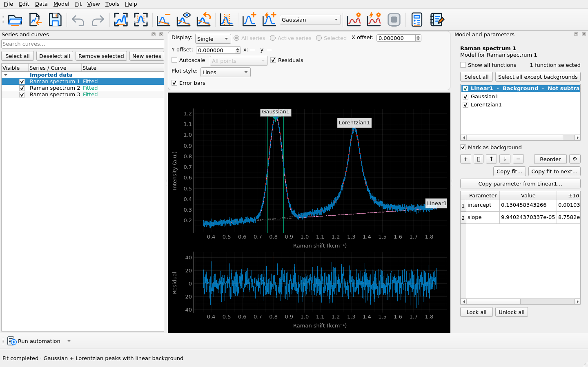
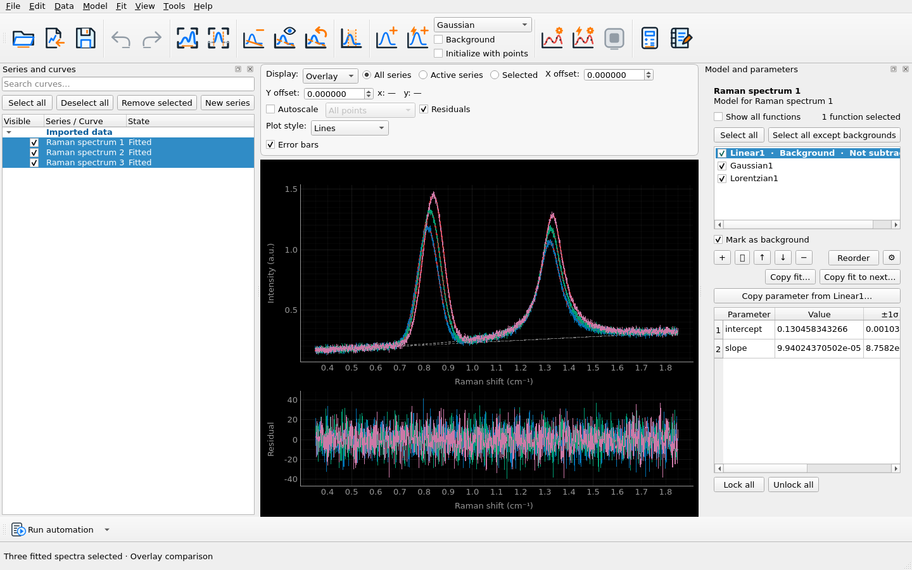
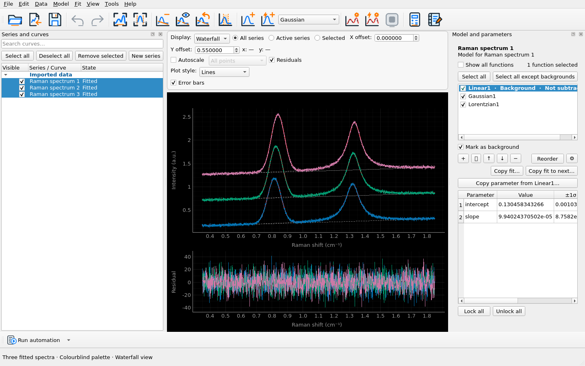
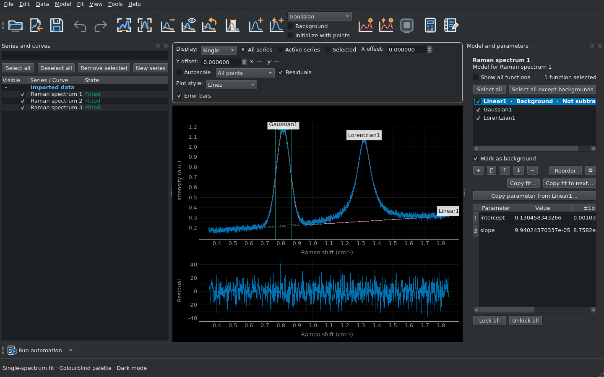

<p align="center">
  
</p>

<h1 align="center">CurveMole</h1>

<p align="center">
  <a href="https://github.com/SebRoLENS/curvemole/releases/latest"></a>
  <a href="https://github.com/SebRoLENS/curvemole/releases/latest"></a>
  <a href="https://github.com/SebRoLENS/curvemole/releases/latest"></a>
  <a href="https://github.com/SebRoLENS/curvemole/releases/latest"></a>
  <a href="https://doi.org/10.5281/zenodo.23065835"></a>
  <a href="https://github.com/SebRoLENS/curvemole/actions/workflows/ci.yml"></a>
</p>

<p align="center"><strong>Scientific curve and peak fitting for spectroscopy, diffraction, kinetics, and general x-y data.</strong></p>

CurveMole is a desktop-first, scriptable scientific data-analysis application for
one-dimensional spectra and curves. It provides interactive curve fitting, peak fitting,
baseline/background modelling, and nonlinear least-squares analysis for IR and Raman
spectra, powder diffraction and XRD patterns, kinetic traces, and general x-y data.
The same scientific engine is shared by the graphical interface, Python API, command
line, and reproducible YAML workflows.

> **Status:** Version **0.33.1 Preview**. The scientific core and desktop workflow
> are usable, but this is not yet the validated 1.0 Stable release.


## Download

**[Download the latest release](https://github.com/SebRoLENS/curvemole/releases/latest)**
· [Browse previous releases](https://github.com/SebRoLENS/curvemole/releases)

Available packages are built automatically for:

- Linux x86_64: AppImage with optional per-user desktop integration
- Windows x86_64: installer (recommended) or portable `.zip`
- macOS Apple Silicon: `.dmg`
- macOS Intel x86_64: `.dmg`
- Python 3.12+: wheel and source distribution

The installed desktop applications register CurveMole projects (`.fitproj`) with
the operating system, so they can be opened by double-clicking or with **Open with
CurveMole**. Linux AppImage users can choose **Tools > Integrate CurveMole with the
desktop**; an existing manual launcher is adopted and backed up instead of duplicated.

> **Windows and macOS security notice**
>
> Windows and macOS packages may be unsigned. Windows SmartScreen or macOS Gatekeeper
> can show a warning when a package lacks a recognised signature or notarization.
> A warning caused by a missing signature is not, by itself, evidence that malware was detected.
> Download CurveMole only from the official release page and verify `SHA256SUMS.txt`.

The Linux AppImage is cryptographically signed using the free, open-source Sigstore
infrastructure through GitHub Actions. Every release includes a detached
`.sigstore.json` signature bundle. With the [GitHub CLI](https://cli.github.com/):

```bash
gh attestation verify CurveMole-VERSION-linux-x86_64.AppImage \
  --repo SebRoLENS/curvemole
```

The clickable status-bar version badge checks for application updates at startup
and hourly. **Help > Check for updates** checks again. Linux AppImage and Windows
installed/portable packages support **Update now**, with SHA-256 verification of the
matching download; save your project before restarting. macOS, Python and source
installations are updated manually from the release page or their source checkout.

## Custom plugins: install or share yours

Open **File > Plugin Manager > Browse validated plugins…** to view the online catalog,
choose a permanent storage folder, and install selected plugins after reviewing and
trusting them. The catalog includes plugins maintained by the main developer and
community contributions, validated on Linux, Windows and macOS.

**[Download latest Community Plugins](https://github.com/SebRoLENS/curvemole/releases/download/community-plugins-latest/validated-community-plugins.zip)**

For a manual download, extract the ZIP, choose an individual plugin folder in
**File > Plugin Manager > Choose plugin folder…**, then review and trust it.
No GitHub account is needed. The link serves the latest published, validated bundle.

**[Share a plugin you created](custom_plugins/README.md#submit-a-plugin)** ·
[Browse the community folder](custom_plugins) ·
[Plugin author guide](docs/plugins.md)

- **Use it on your PC:** open **File > Plugin manager > Choose plugin folder…**,
  select the folder containing your manifest and Python module, then **Review and trust**.
- **Share it with other users:** submit a folder at **`custom_plugins/by_community/your_plugin/`**
  through a GitHub pull request. Follow the upload steps linked above. GitHub tests
  the submission; only successful main runs produce the validated catalog bundle.

The Plugin Manager also includes **Share my plugin on GitHub…**, which opens these
submission instructions. Loading a plugin locally does not upload it publicly.

Loaded community plugins are checked for updates at startup and hourly. Use the
**Plugins** status badge or **Plugin updates…** to update selected plugins, then restart
CurveMole to activate them. Plugins execute Python code; validation and source review
help you decide which plugins to trust. See the [plugin guide](docs/plugins.md) for
local installations, dependencies, API compatibility, and removal.

## Why CurveMole?

CurveMole is designed for experimental scientists who want the convenience of an
interactive desktop GUI without giving up reproducibility or scriptability. A fit can
be explored graphically and then reproduced through the Python API, CLI, or YAML
workflow using the same fitting engine and scientific conventions.

It is intended as a general-purpose open-source tool for spectroscopy, diffraction,
kinetics, peak analysis, and other one-dimensional scientific datasets rather than a
workflow tied to a single experimental technique.

## Documentation

- **[Detailed user manual (Markdown)](docs/manual.md)** - authoritative source,
  with the supported CurveMole version declared at the top
- **[User manual (PDF)](docs/CurveMole_User_Manual.pdf)** - generated automatically
  from the Markdown source
- **[User manual (LaTeX)](docs/CurveMole_User_Manual.tex)** - generated source used
  to compile the PDF
- **[Quick Start](docs/quick-start.md)** - compact first-workflow guide

The documentation workflow verifies the declared software version, local links,
LaTeX conversion, and PDF compilation. Versioned PDF and LaTeX manuals are attached
to releases.

## Highlights

- Gaussian, Lorentzian, Voigt, and pseudo-Voigt peaks parameterised by signed area
- constant, linear, arbitrary-order polynomial, and cubic-spline backgrounds
- content-aware import of valid numeric text files regardless of extension, with
  automatic/manual leading-row skipping, reusable batch mappings, and live previews
- calibrated, one-dimensional, single-ROI WinSpec SPE 2.x import with a wavelength axis
- opt-in automatic folder import of new acquisition files, with filename filtering,
  stable-file checks, and optional processing by a trusted plugin
- fixed values, lower/upper bounds, intervals, and expression links across spectra
- independent, propagating sequential, and global simultaneous least-squares
  fitting, with configurable safeguards and durable pause/resume
- local least-squares methods, differential evolution with local refinement,
  Nelder-Mead, Powell, L-BFGS-B, and explicit solver-specific controls
- reversible transformations and graphical masks with immutable original data
- function-aware Quick Add, selectable automatic peak shapes, click-drag peak
  placement, live spline backgrounds, and direct right-drag interval masking
- project-wide function editing with **Select all** / **Select all except backgrounds**
  controls and separate enable/disable checkboxes
- undoable **Reorder** sorts the function list by X position and renumbers automatic
  names; custom names are retained and advanced rules choose another sorting parameter
- function selection stays at the same list position when switching spectra in the
  active-spectrum Functions view; shorter models select their last function
- explicit, undoable parameter copying between compatible functions, including
  optional bounds, fixed state, and links
- reusable user-defined function libraries with explicit peak parameter roles for
  reliable graphical and automatic initialisation
- live fit refresh, adaptive rendering for dense spectra, background-subtracted
  inspection, and non-destructive viewport navigation during fitting
- Overlay and Waterfall comparison with **All series / Active series / Selected**
  display controls, Ctrl/Shift selection, themes, and a colourblind-safe palette
- a **Data Calculator** with advanced formulas across all imported columns,
  including unplotted columns, and single-spectrum or grouped selection scopes
- covariance statistics, confidence intervals, profile likelihood, Monte Carlo,
  residual bootstrap, and block bootstrap
- portable, versioned `.fitproj` projects without pickle, recent-project access,
  Undo/Redo for fits and model edits, and recovery after an abnormal exit
- a **Laboratory notebook** for project notes and descriptions of series, spectra,
  and functions, saved in the project and exportable as TXT
- human-friendly Wide exports, Python-friendly Tidy exports, and one-file-per-spectrum
  numeric export of data, components, total fit, background, and residuals
- a separate **Run automation** button with a remembered YAML workflow
- Python API, CLI, YAML workflows, custom formulas, and trusted additive plugins
- **File > Plugin Manager** for catalog browsing, persistent loading, selected updates,
  removal, and crash recovery; [write exporters, fit algorithms and other extensions](docs/plugins.md)

**Quick Fit** always uses **Single/Independent** fitting for the selected spectra,
or the active spectrum when nothing is selected. Its first use takes the default
solver settings; later runs reuse the current settings. While a sequential fit is
paused, Quick Fit fits only the active spectrum and keeps the saved sequence suspended.

**Sequential** fitting starts from a prepared source spectrum without refitting it.
The fitted model propagates to later selected spectra while preserving functions
already on each target. Background functions are excluded from copying by default;
the dialog lets you choose copy exclusions and which constraints and function states
to propagate. Residual or parameter-change safeguards can pause the sequence for
inspection. **Continue sequential fit**, **Terminate sequential fit**, and
**Last pause reason** remain available for managing the pause. For shared parameters
across spectra in one optimization, choose **Global simultaneous** fitting.

In the Functions panel, highlighted rows select functions for editing; checked boxes
include them in the model and fit. Selecting rows does not enable or disable functions.
Changing a checkbox on a selected row applies that state to every selected function.

## Interface and real usage examples

### Multi-peak fit with background and residuals



A deterministic Raman-like dataset fitted with a linear background, a Gaussian peak,
and a Lorentzian peak. The complete interface shows the measured curve, individual
components, model sum, residuals, fitted parameters, uncertainties, and curve state.

### Comparing a fitted series



Three related spectra are fitted independently and inspected together in Overlay view.
All spectrum colours use CurveMole's built-in **Colourblind** palette.

### Waterfall view



The same fitted series displayed with a vertical offset in Waterfall view, while
preserving the model components and residual information.

### Dark mode



The single-spectrum fit shown with CurveMole's dark interface theme and the same
colourblind-safe spectrum palette.

All four screenshots are generated from the real application by
[`scripts/generate_screenshots.py`](scripts/generate_screenshots.py) and refreshed
automatically whenever the graphical interface changes.

## Install and run from source

Python 3.12 or newer is required.

```bash
git clone https://github.com/SebRoLENS/curvemole.git
cd curvemole
python -m venv .venv
source .venv/bin/activate          # Windows: .venv\Scripts\activate
python -m pip install -e .
curvemole gui
```

Try the complete example:

```bash
curvemole run examples/gaussian_workflow.yml
```

Run tests:

```bash
uv sync --locked --group dev
uv run pytest
```

The manual, Quick Start, and [plugin guide](docs/plugins.md) are included offline.
Maintainers can consult the [automated release guide](docs/releasing.md).

## Scientific conventions

Built-in peak amplitude is the signed integrated area. Widths are strictly positive;
pseudo-Voigt mixing is bounded to `[0, 1]`. Original data are never overwritten.
Masks and transformations remain visible, reversible, and serialised. CurveMole never
silently changes the solver, excludes points, or normalises global contributions.

The preview supports `sigma_y` weighting; imported `sigma_x` is stored but is not
used in optimization. No solver guarantees a global optimum for an arbitrary nonlinear
model. Inspect residuals, parameter correlations, constraints, and uncertainty results;
see the [manual](docs/manual.md) for scientific conventions and current limitations.

## Author and contact

Sebastiano Romi  
European Laboratory for Non-Linear Spectroscopy (LENS)  
University of Florence (UNIFI)  
[romi@lens.unifi.it](mailto:romi@lens.unifi.it)

## Version

Current public version: **0.33.1**

## How to cite

If CurveMole contributes to published research, please cite the exact version used.
GitHub also provides a **Cite this repository** entry from [`CITATION.cff`](CITATION.cff).

> Romi, S. (2026). *CurveMole: Modular Scientific Curve Fitting* (Version 0.33.1)
> [Computer software]. Zenodo. https://doi.org/10.5281/zenodo.23065835

DOI: [**10.5281/zenodo.23065835**](https://doi.org/10.5281/zenodo.23065835)

## License

CurveMole is free software released under **GPL-3.0-or-later**. User data, projects,
results, private formulas, and unpublished private extensions remain under the user's
control. Citation metadata are provided in `CITATION.cff`.
